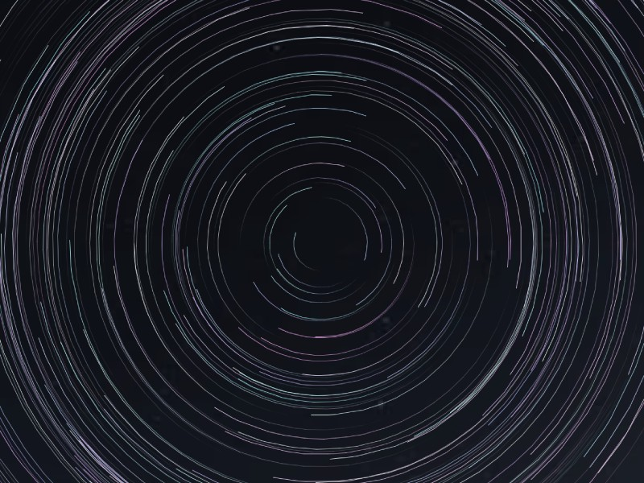

## Star trails

### Open in IDE
Intellij:
- Open project 
- Define SDK as ver. 16 (probably a popup in the IDE)
- Settings -> Invalidate caches (invalidate & restart)
- Run Main.java

Eclipse:
- Open Project 
- Run Main.java

((Make sure core.jar is known as a library in the IDE))

### Controls:
- Arrow keys:
    - left/right: decrease/increase speed
    - down/up: decrease/increase star trail length

Top left shows FPS, speed & fade time.

https://en.wikipedia.org/wiki/Star_trail

https://github.com/Max-7777

https://processing.org/

maxcontact5@keemail.me